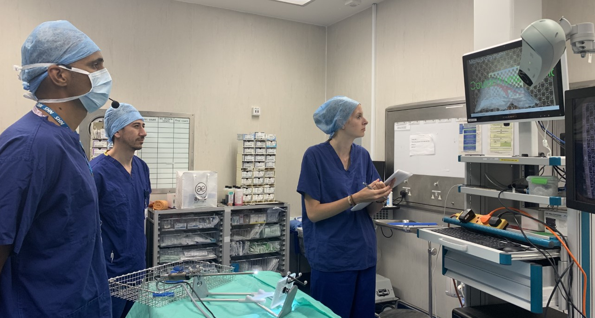

This is the front page for SciKit-Surgery

Usage
-----
You string together some libaries, for example an image source (SciKit-SurgeryImage), some image proceing (SciKit-SurgeryTorch), and a tracker source (SciKit-SurgeryNDITracker), together with a visualisation window (SciKit-SurgeryVTK) to create an application.

Application Examples
--------------------
SmartLiver
**********

The `SmartLiver <https://doi.org/10.1007/s00464-020-07807-x>`_ augmented reality guidance system for key hole liver surgery built on the SciKit-Surgery libraries is currently undergoing clinical trials at the Royal Free Hospital London. The image above shows a user interface using SciKit-SurgerySpeech being tested.

SnappySonic
link to paper
image

SciKit-SurgeryBARD
image

SciKit-SurgeryFRED
link to paper
image

