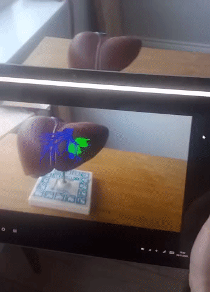

This is the front page for SciKit-Surgery

Usage
-----
You string together some libaries, for example an image source (SciKit-SurgeryImage), some image proceing (SciKit-SurgeryTorch), and a tracker source (SciKit-SurgeryNDITracker), together with a visualisation window (SciKit-SurgeryVTK) to create an application.

Application Examples
--------------------
SmartLiver
**********

The `SmartLiver <https://doi.org/10.1007/s00464-020-07807-x>`_ augmented reality guidance system for key hole liver surgery is built on the SciKit-Surgery libraries and within our ISO-13485 quality management system. SmartLiver is currently undergoing clinical trials at the Royal Free Hospital London. SmartLiver uses `SciKit-SurgeryCore`_, `SciKit-SurgeryBK`_, `SciKit-SurgeryImage`_, `SciKit-SurgeryVTK`_, `SciKitSurgery-NDITracker`_, `SciKit-SurgerySpeech`_, `SciKit-SurgeryTF`_, `SciKit-SurgerySurfaceMatch`_, `SciKit-SurgeryTorch`_, and `SciKit-SurgeryCalibration`_. The image above shows the user interface using SciKit-SurgerySpeech being tested in theatre.

SnappySonic
***********

.. raw:: html

  <iframe width="560" height="315" src="https://www.youtube.com/embed/BI4qyg9NEOk"  frameborder="0" allow="accelerometer; autoplay; encrypted-media; gyroscope; picture-in-picture" allowfullscreen></iframe>

`SnappySonic <https://openresearchsoftware.metajnl.com/articles/10.5334/jors.289/>`_ is an ultrasound simulator developed primarily for educational purposes. SnappySonic uses `SciKit-SurgeryUtils`_, `SciKit-SurgeryNDITracker`_, `SciKit-SurgeryArucoTracker`_, and `SciKit-SurgeryImage`_.

SciKit-SurgeryBARD
******************

`SciKit-SurgeryBARD <https://github.com/UCL/scikit-surgerybk>`_ uses `SciKit-SurgeryCalibration`_, `SciKit-SurgeryCore`_, `SciKit-SurgeryUtils`_, `SciKit-SurgeryVTK`_, `SciKit-SurgerySpeech`_, and `SciKit-SurgeryArucoTracker`_ to build a Basic Augmented Reality Demonstrator. SciKit-SurgeryBARD was developed for `educational <https://miccai-sb.github.io/materials.html#mec2020>`_ purposes, but by swapping `SciKit-SurgeryArucoTracker`_ for `SciKitSurgery-NDITracker`_ it can be used as a minimal system for surgical augmented reality.

SciKit-SurgeryFRED
******************
.. raw:: html

  <iframe width="560" height="315" src="https://www.youtube.com/embed/t_6CH5uroYo" frameborder="0" allow="accelerometer; autoplay; encrypted-media; gyroscope; picture-in-picture" allowfullscreen></iframe>

link to paper
image

.. _`SciKit-SurgeryCore`: https://github.com/UCL/scikit-surgerycore
.. _`SciKit-SurgeryBK`: https://github.com/UCL/scikit-surgerybk
.. _`SciKit-SurgeryUtils`: https://github.com/UCL/scikit-surgeryutils
.. _`SciKit-SurgeryArucoTracker`: https://github.com/UCL/scikit-surgeryarucotracker
.. _`SciKit-SurgeryImage`: https://github.com/UCL/scikit-surgeryimage
.. _`SciKit-SurgeryVTK`: https://github.com/UCL/scikit-surgeryvtk
.. _`SciKitSurgery-NDITracker`: https://github.com/UCL/scikit-surgerynditracker
.. _`SciKit-SurgerySpeech`: https://github.com/UCL/scikit-surgeryspeech
.. _`SciKit-SurgeryTF`: https://github.com/UCL/scikit-surgerytf
.. _`SciKit-SurgerySurfaceMatch`: https://github.com/UCL/scikit-surgerysurfacematch
.. _`SciKit-SurgeryTorch`: https://github.com/UCL/scikit-surgerytorch
.. _`SciKit-SurgeryCalibration`: https://github.com/UCL/scikit-surgerycalibration
